# Web3 Carnival — independent redesign

A responsive, scrapbook-inspired redesign of Web3 Carnival: ruled-paper canvas, taped event photography, punchy festival typography, and interactive pathways through the community. The static website lives in [`dist/`](dist/); no framework or build step is required.

> This is an independent redesign prototype, not the official event or ticketing site. Event dates, venue, prices, and next-edition availability are not confirmed. Historical affiliations and source material are credited in [SOURCES.md](SOURCES.md).

## Page gallery

### Home — the scrapbook entrance

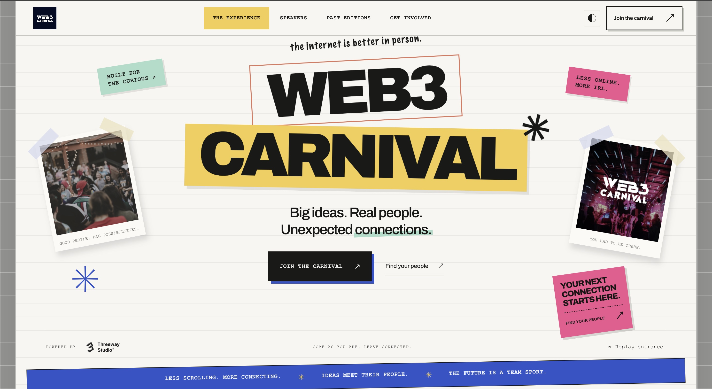

The homepage sets the visual language and brings the event into focus with a finite, replayable entrance animation. Its continuous ticker reads “Less scrolling. More connecting.”; the navigation follows the section currently in view. Documentary images, loose notes, paper shadows, and the blue ticker balance the otherwise calm ruled-paper layout.

**Distinctive UI:** dimensional photo collage; staggered hero assembly with replay control; looping ticker; scroll-aware active navigation; next-edition status card; track selection that stamps a personal Carnival Passport; saved-in-browser interests; expandable speaker directory and profile dialogs; location-filtered horizontal event rail; theme toggle; role-based community tabs; FAQ disclosures; privacy and credits panel.

The feature views below show the homepage journey beyond the opening: next-edition context, the assembled scrapbook community, interest-based passport, and role-specific ways to take part.

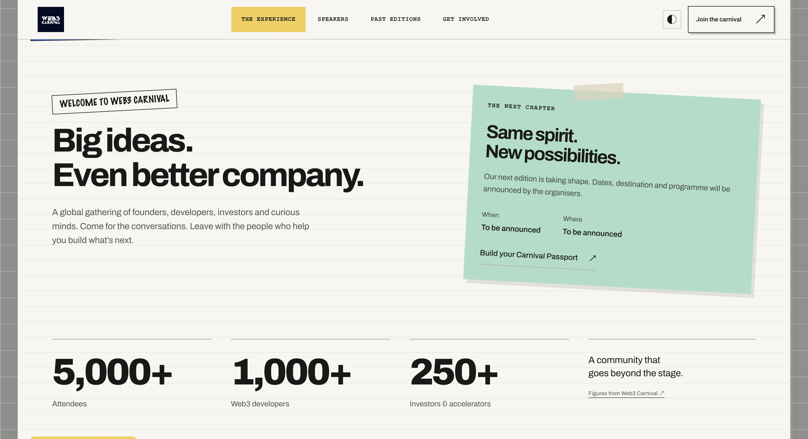

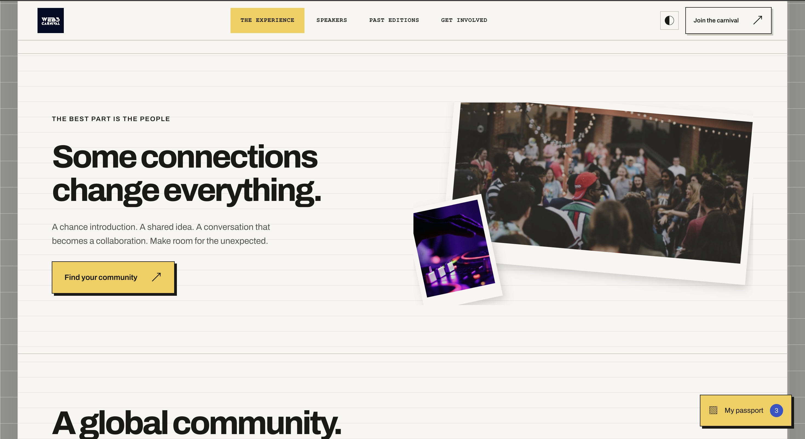

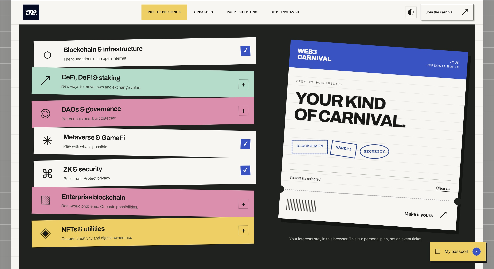

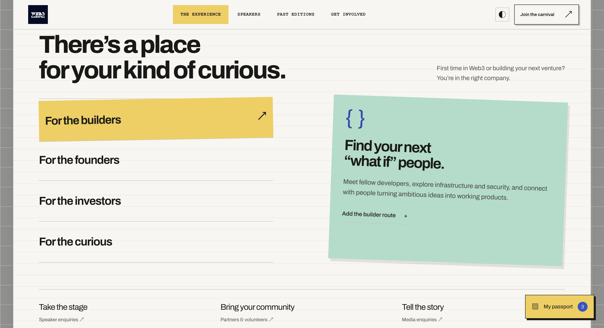

### Past events — the archive

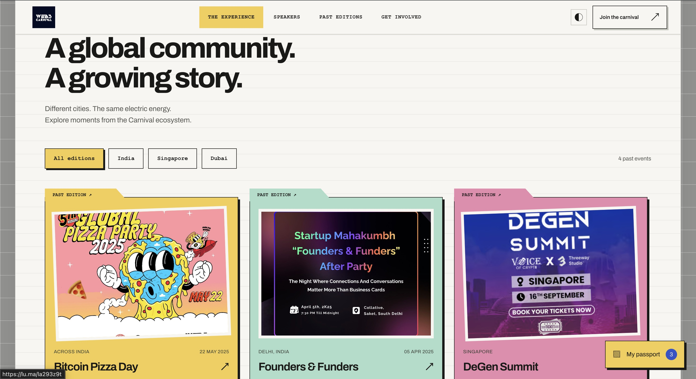

The archive brings together all 14 public past-event listings found on the original website. Search by event, date, or city, then narrow the archive by India, Singapore, or Dubai. Each card retains its source-listed details and destination link.

**Distinctive UI:** live text search; location filters; responsive archival card grid with original event art; clear results count and empty state; source links for each past listing.

### Past speakers — people behind the conversations

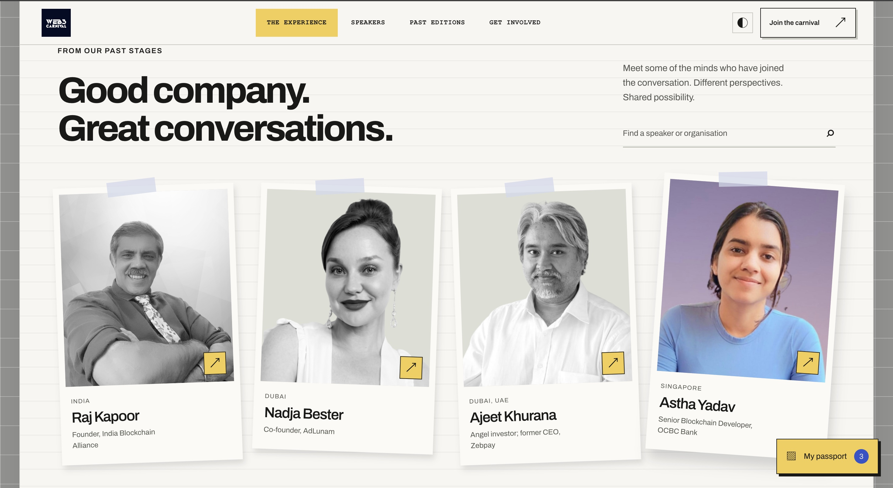

Browse the 69 people listed in the original public speaker archive. Roles and locations are presented as historical source listings, not current endorsements.

**Distinctive UI:** searchable directory across names, organisations, and locations; portrait-led responsive cards; historical role and location labels; social profile links where listed; direct link to the original speaker application.

### Ecosystem — the past partner network

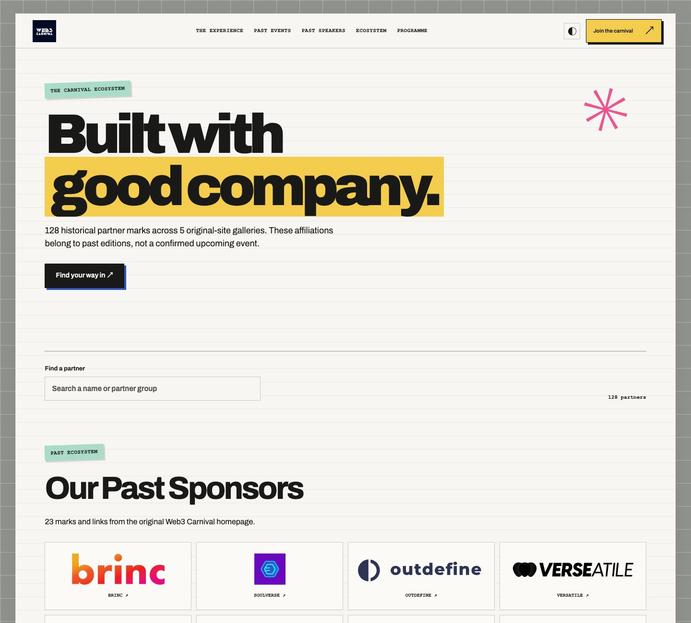

Five source-site galleries are organised into one searchable collection of 128 historical partner marks. Affiliations are clearly scoped to past editions.

**Distinctive UI:** live partner search spanning every gallery; count feedback; grouped, responsive logo cards; links to partner destinations; a clear path to contact organisers about partnership.

### Programme — mission, participation, and awards

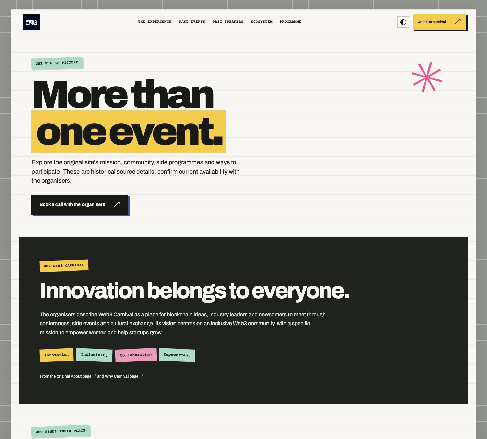

The programme page fills in the story beyond the homepage: mission, audience, Demo Night, awards, and ways to participate. It includes eight audience pathways, startup/investor/incubator application links, all 23 award categories, and official contact, policy, and social links.

**Distinctive UI:** contrasting editorial story panel; audience pathway cards; application routes for Demo Night; complete numbered award-category list; nomination calls to action; prominent historical-information and availability context.

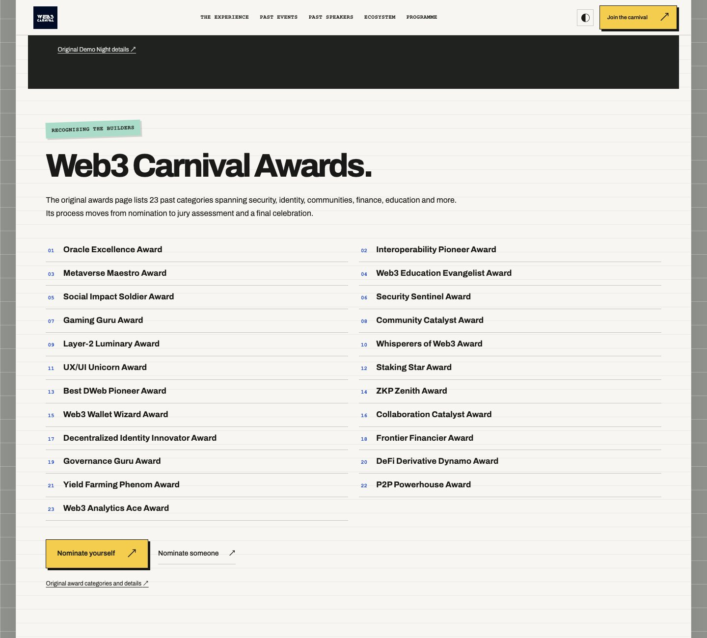

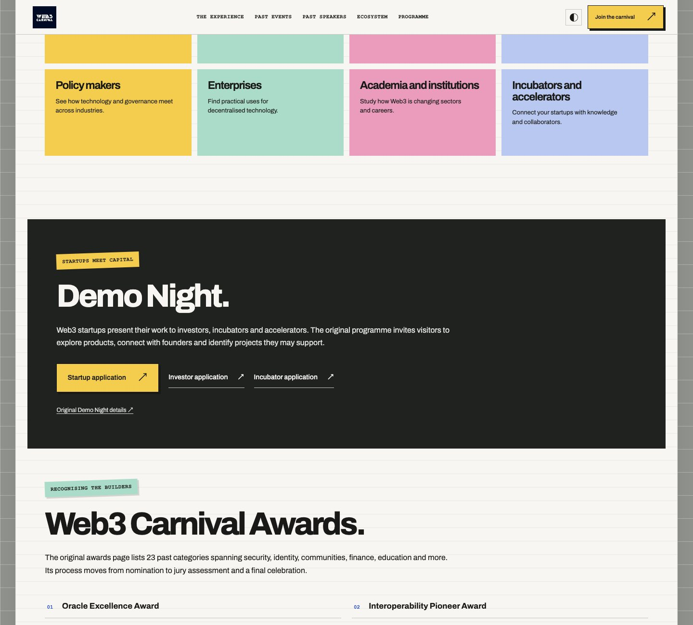

## Run locally

From this folder, serve the static site:

```sh
python3 -m http.server 4500 --directory dist
```

Then visit [http://localhost:4500](http://localhost:4500). The home page is `dist/index.html`; the other pages are linked from its navigation and footer.

## Interaction and accessibility

- Desktop, tablet, and mobile layouts, including a separate stacked mobile hero composition.
- Keyboard-accessible navigation and controls, skip link, semantic headings, labels, and profile dialogs.
- Reduced-motion mode preserves the content and suppresses decorative movement.
- Light/dark theme and selected interests persist locally in the browser.
- The Carnival Passport is a personal plan, not a ticket or blockchain asset. Registration is a local prototype and does not submit personal information to a backend.
- Search and filtering remain local to the page. Official source/application links open their respective destinations.

## Project notes

- [BRIEF.md](BRIEF.md) — original brief, design rationale, journey, motion, and interaction model.
- [SOURCES.md](SOURCES.md) — source-site content and asset provenance.
- [VERIFICATION.md](VERIFICATION.md) — implementation checks and known limitations.
- [screenshots/pages/](screenshots/pages/) — README page captures.
- [output/pdf/](output/pdf/) — submission presentation for the earlier ink/orange revision; it has not been regenerated for the scrapbook revision.

The copied Scroll Craft engine is unchanged. Custom visual and interaction layers live in `dist/scrapbook.css`, `dist/scrapbook.js`, and the page assets.
